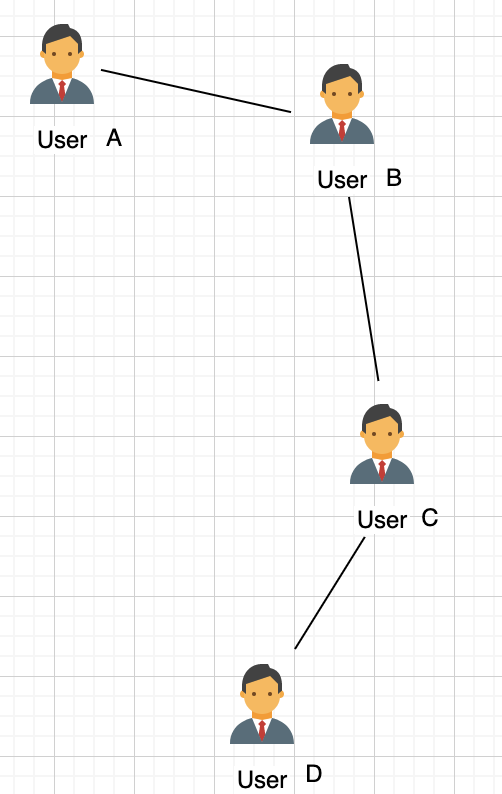
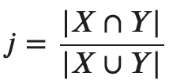
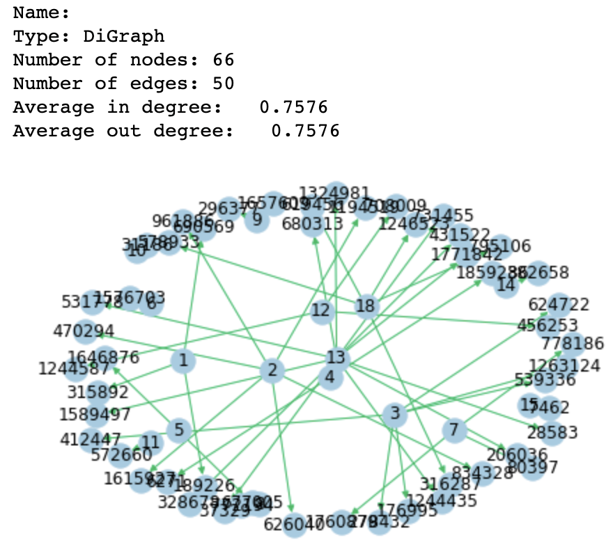
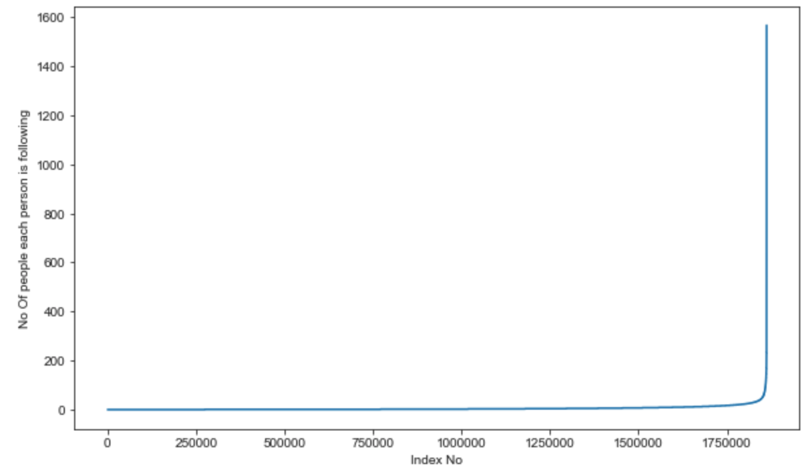
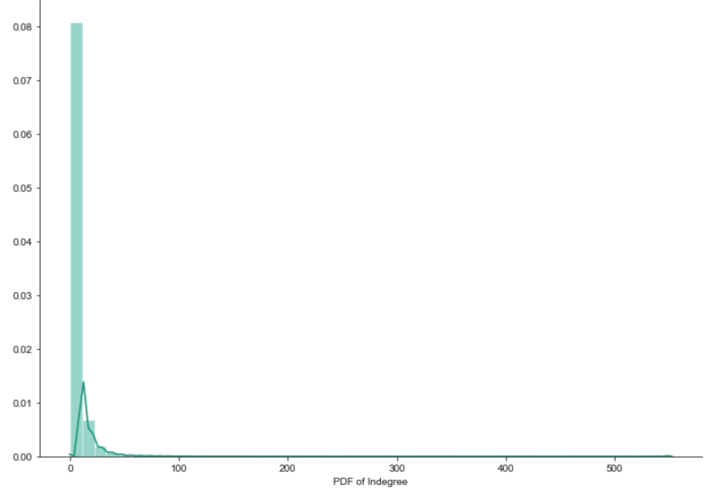
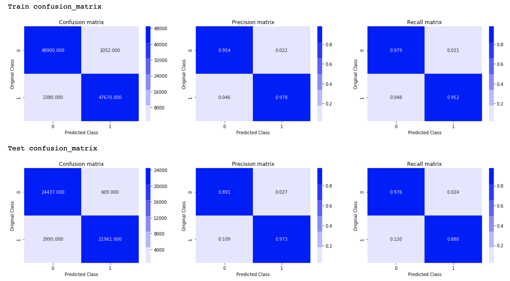
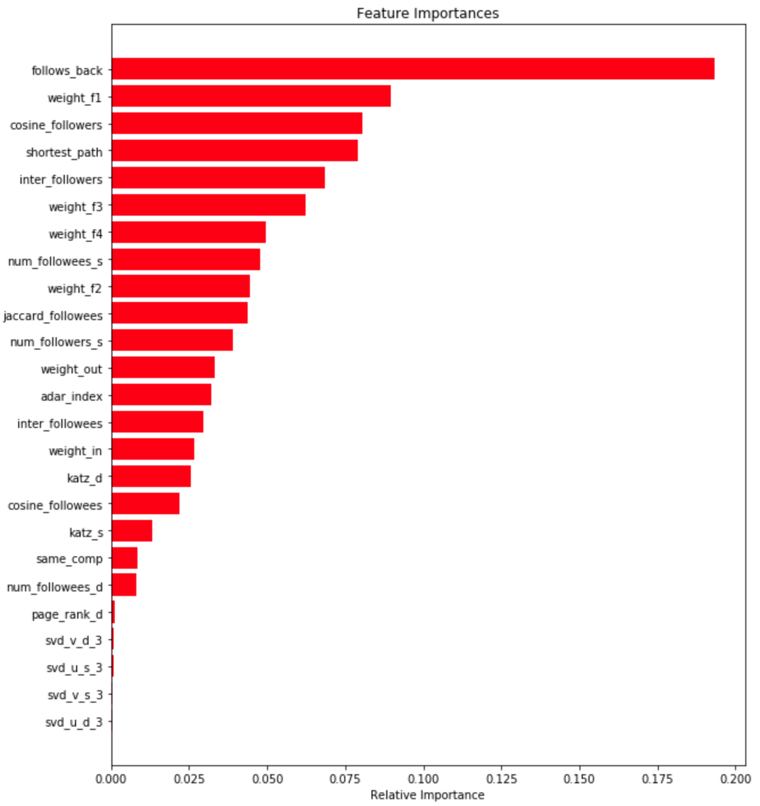

# Facebook Graph Link Prediction Problem

## Quick Introduction
  
  ### Data Overview:
      We are given 2 numerical features:  
     
|  Data columns                 | Type                              |
| ------------------------------| --------------------------------- |
| source_node                   | int64                             |
| destination_node              | int64                             |

   We have 1.86 M users / nodes in the graph.
   We have 9.43 M directed edges.  
   **NOTE:** We are only given a snapshot of data at a time t, since we aren’t given any timestamps corresponding to the data.

## Problem Statement 
Given a directed social graph, have to predict missing links to recommend users (Link Prediction in graph)

**Business objectives and constraints:**
- No low-latency requirement.
- Probability of prediction is useful to recommend highest probability links

## Approach 
Posing this problem as a binary calssification task. 
  Let the connected nodes be given a target class label of 1. We are only given points having target class label of 1 in our dataset. To pose this problem as a binary calssification task, I did the following:
  1. Let the set containing all the possible edges in my graph be denoted by G.
  2. Let bad_edges be a set defined as, bad_edges = G - edges present in our training data (points with class label 1).
  3. Take a random sample of 2 edges bad_edges of size equal to our training data (9.43 M) can set thee class label of these points to 0.
  **NOTE:** 
  While generating points of class label 0, this situation may arise:
  Let A, B, C, D be 4 nodes/users in out social network graph(nodes in our dataset), lets say their orientation in some n dimensional space be given as show below:
   

  
  - Let len(u1, u2) denote the shortest path between 2 arbitrary nodes in our graph.
  - As we can see there is no edge between A-C and A-D. But len(A,C) = 2, so there is a high probability that A & C will connect on the future. 
  - len(A,D) = 3, while generating new points with class label 0, we only do so for points having shortest path greater than 2.  
  
  We now have a balanced dataset with class labels 1, 0.
  
## Feature Engineering: Graph Featurization
Since we are basically given a dataset that represents node, edges in a graph, this dataset can't be directly used for ML modelling. We first have to come up with features that are pertinent for our use case. Some of the feature I built are:

1. Jaccard Distance(j): 
Given 2 sets, X and Y, Jaccard distance is defined as the ratio of the size of the intersection between the sets and the size of the union between the sets.

   Intuition: Higher the Jaccard Distance higher is the likelihood of an edge between the two nodes. 
   
   We now can get 2 features from this concept. jaccard_for_followers, jaccard_for_followees
   
2. Shortest Path:
   This feature just gets the shortest path between 2 nodes, if the nodes have an edge i.e, trivially connected then we are removing that edge and calculating the shortest path.

## Results

1. Modelled the given dataset as a directed graph, and posed the problem as a binary classification task, to predict the presence/absence of an edge between 2 nodes/users.
2. Engineered various graph specific features like shortest path, jaccard/cosine distance for followers/followees e.t.c
3. Built and tuned a Random Forest Classifiers and optimized for the best F-1 score.
4. Extracted the feature importance from the model, follows back is the most important.
5. Tuned the Random Forest Classifier gave an F-1 score of 0.96 on the training data and 0.92 on the test data.

## Interesting Plots:

  
**Observations:**
- Visualizing a subset of the graph with high-level statistics.

  
**Observations:**
- We can see that there is one person that follows 1500+ people, but most people follow fewer people.

  
**Observations:**
- Most users have a small number of followers.
  

  
**Observations:**
- Change in F-1 score with varying the number of estimators of the Random Forest classifier, to find the optimal number of estimators.
  

**Observations:**
- Change in F-1 score with varying depth of the Random Forest classifier, to find the optimal depth.
  

**Observations:**
- The precision of class 0 on the test data (0.891) seems low, compared to the train data (0.954)
- The recall of class 1 on the test data (0.880) seems low, compared to the train data (0.952)
- This might be because of cold start problem.
  

  
**Observations:**
- Feature importance extracted from the Random Forest classifier.

  

  
  
  
