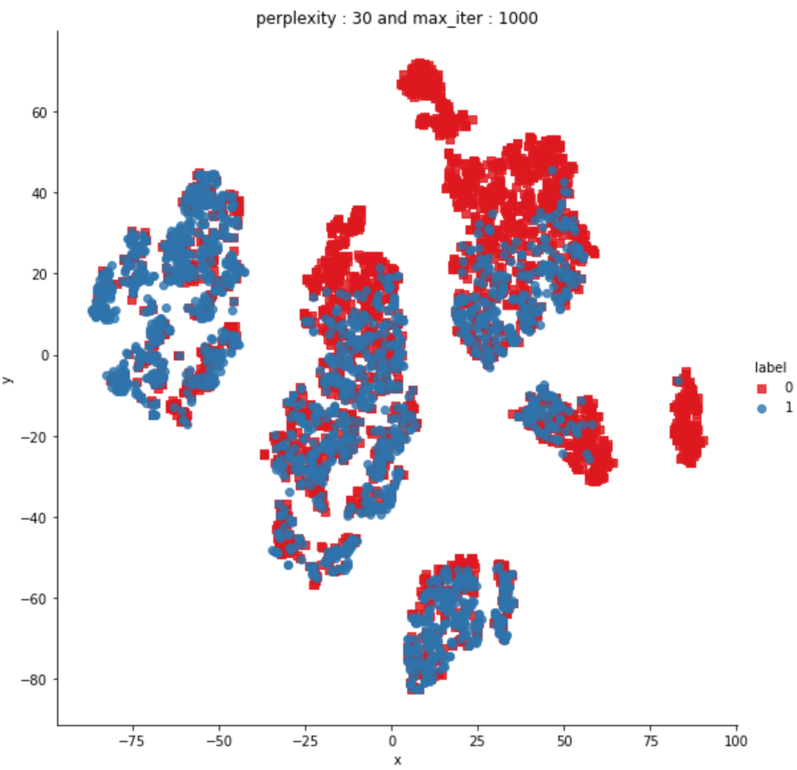

# Quora Question Pair Similarity

Source:  https://www.kaggle.com/c/quora-question-pairs

## Quick Introduction 

Given a dataset containing question id's, 2 questions (text format) and a binary target variable we have to predict the target variable of new questions

| Target Variable               | Mapping                                    |
| ------------------------------| ------------------------------------------ |
| 0                             | not duplicates                             |
| 1                             | duplicates                                 |

## Problem Statement
  - Identify which questions asked on Quora are duplicates of questions that have already been asked.
  - This could be useful to instantly provide answers to questions that have already been answered.
  - We are tasked with predicting whether a pair of questions are duplicates or not.
  
  ### Real world business objectives and constraints: 
    - The cost of a mis-classification can be very high.
    - You would want a probability of a pair of questions to be duplicates so that you can choose any threshold of choice.
    - No strict latency concerns.
    - Interpretability is partially important.

## Approach

This problem can be formulated as a binary classification task. Since the only features given in our dataset are the 2 question given as text, we have to engineer features from this text data to serve as input to our classification model.

Performance Metrics: 
  - As specified in the Kaggle competition by Quora Log Loss would be our KPI.
  - We will also be looking at the Binary Confusion Matrix to get a better intuition of model performance

## Examples of engineered features:
  ### Definition:

  - Token: You get a token by splitting sentence a space
  - Stop_Word : stop words as per NLTK.
  - Word : A token that is not a stop_word
  ### Features:

  - cwc_min : Ratio of common_word_count to min length of word count of Q1 and Q2
 
  - csc_max : Ratio of common_stop_count to max length of stop count of Q1 and Q2
  
  - ctc_max : Ratio of common_token_count to max length of token count of Q1 and Q2
  
  - last_word_eq : Check if last word of both questions is equal or not
  
  - first_word_eq : Check if First word of both questions is equal or not
  
  - abs_len_diff : Abs. length difference
  
  - mean_len : Average Token Length of both Questions
 

## Fuzzy Features:

  - fuzz_ratio : https://github.com/seatgeek/fuzzywuzzy#usage 

  - fuzz_partial_ratio : https://github.com/seatgeek/fuzzywuzzy#usage 

  - token_sort_ratio : https://github.com/seatgeek/fuzzywuzzy#usage 

  - token_set_ratio : https://github.com/seatgeek/fuzzywuzzy#usage

  - longest_substr_ratio : Ratio of length longest common substring to min length of token count of Q1 and Q2
  
  - longest_substr_ratio = len(longest common substring) / (min(len(q1_tokens), len(q2_tokens))

## Results 

  - Preprocessed, featurized text data using TF-IDF weighted Word2vec, posed a binary classification task. 
  - Experimented with various ML models, tuned best performing GBDT model yielding a log loss of 0.357. 
  
## Interesting Plots:

### T-SNE visualization: 15 feature space brought down to 2D space 
  
 

 
 **Observations:**
- We see that though there is significant overlap between data points of both the classes, there are also regions isolation  data points belonging to a               particular class, implying that the new engineered features can be used to classify data points.

  
  

